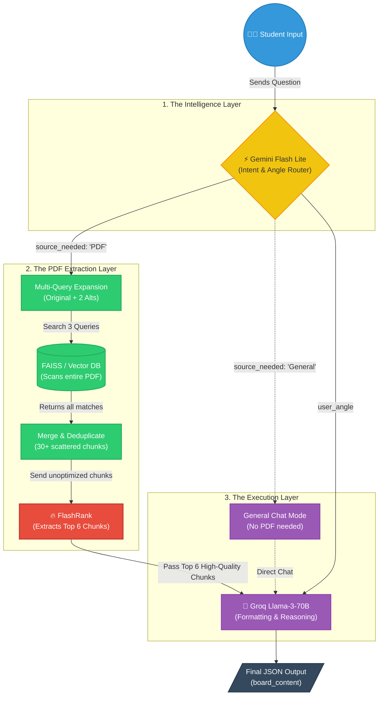

# AI Engine Architecture: The "Single-Shot" Pipeline

Here is the graphical representation of how your newly optimized AI system works behind the scenes.

## Flow Diagram

## How it works (Step-by-Step):

1. **The Intelligence Layer (Gemini):**
   - As soon as the student asks a question, **Gemini Flash Lite** reads it. 
   - It decides if the question needs the PDF (`source_needed`) and how the student is feeling (`user_angle`).

2. **The Extraction Layer (FAISS + FlashRank):**
   - If the PDF is needed, the system breaks the question into 3 variations.
   - It searches the **Vector DB** using all 3 variations to ensure no scattered data is missed.
   - It combines all the results and gives them to **FlashRank**.
   - FlashRank acts as a strict gatekeeper and only allows the **Top 6 absolute best** chunks to pass through.

3. **The Execution Layer (Llama-3):**
   - **Groq Llama-3-70B** receives the perfect 6 chunks AND the user's emotion instruction.
   - It formats the exact response needed and outputs it in JSON, ready for the UI.
